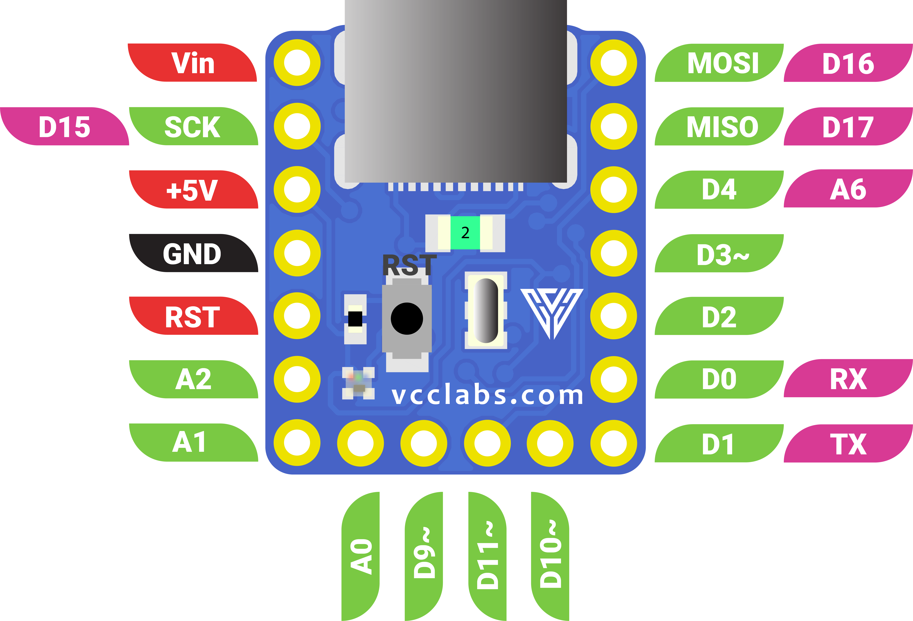

# PICO

This repo is still under construction, all related files will be released very soon!
<div align="center">


# PICO

### A Tiny and Powerful Arduino-Compatible Development Board for Makers

[](LICENSE)
[](https://creativecommons.org/licenses/by/4.0/)
[](https://www.kickstarter.com/projects/vcclabs/pico-a-tiny-and-powerful-development-board-for-makers)
[](https://www.arduino.cc/)

</div>

---

## Introduction

**PICO**: a tiny but powerful Arduino-compatible development board built for makers who don't want to compromise. Measuring just **17.78 × 15.24 mm (0.7" × 0.6")**, PICO is small enough to disappear into wearables, drones, and pocket-sized prototypes, yet packs enough capability to drive serious projects.

At its core, PICO runs the proven **ATmega32U4** microcontroller and exposes **14 GPIOs**, giving you plenty of room to connect sensors, displays, motors, and just about anything else you can dream up. A built-in **WS2812 addressable RGB LED** on pin D5 adds a splash of color for status indication or pure fun. The board is fully **breadboard compatible**, so you can prototype quickly without extra adapters.

PICO is **open source** by design. All schematics, PCB layouts, and source files are available in this repository, so you're free to learn from it, modify it, or build on top of it.

---

## Features

- **Ultra-compact**: 17.78 × 15.24 mm (0.7" × 0.6") footprint
- **ATmega32U4**: microcontroller with native USB
- **14 GPIOs**: including PWM, ADC, I²C, SPI, and UART
- **Built-in WS2812 RGB LED**: (addressable, on pin D5)
- **Breadboard friendly**: castellated pins
- **Multiple power options**: USB and VIN
- **Arduino IDE compatible**: program it like any Arduino Leonardo
- **Fully open source**: schematics, PCB, and code freely available

---

## Specifications

| Category | Specification |
|---|---|
| **Microcontroller** | ATmega32U4 |
| **Architecture** | 8-bit AVR |
| **Clock Speed** | 16 MHz |
| **Flash Memory** | 32 KB (4 KB used by bootloader) |
| **SRAM** | 2.5 KB |
| **EEPROM** | 1 KB |
| **GPIO Pins** | 14 <!-- TODO: confirm digital vs analog split --> |
| **PWM Channels** | 3 (D4 D10 D11) |
| **Analog Inputs** | 5 (D4 D12 A0 A1 A2) |
| **Communication** | USB, I²C, SPI, UART |
| **Operating Voltage** | 5 V |
| **Input Voltage (VIN)** | 7V~15V or power from USB port |
| **DC Current per I/O Pin** | 40mA |
| **Onboard LED** | 1× WS2812 addressable RGB (1 × 1 mm) on D5 |
| **USB Connector** | USB Type-C (**Use USB Typ-A to Type-C cable, I forgot to add the 5.1K resistord on CC pins 🐸**) |
| **Dimensions** | 17.78 × 15.24 mm (0.7" × 0.6") |
| **Weight** | ~1.1 g |

---

## Pinout

<div align="center">



</div>

| Pin   | Type           | Alternate Functions          | Notes                          |
|-------|----------------|------------------------------|--------------------------------|
| Vin   | Power (input)  | —                            | 7–15 V external supply         |
| +5V   | Power (output) | —                            | Regulated 5 V output           |
| GND   | Ground         | —                            | Common ground                  |
| RST   | Reset          | —                            | Active low; pull to GND to reset |
| SCK   | Digital        | D15, SPI Clock               | SPI bus                        |
| MOSI  | Digital        | D16, SPI Master-Out          | SPI bus                        |
| MISO  | Digital        | D17, SPI Master-In           | SPI bus                        |
| D4    | Digital        | A6 (Analog In)               | ADC capable                    |
| D3 ~  | Digital        | PWM                          | PWM output                     |
| D2    | Digital        | —                            | General-purpose I/O            |
| D0    | Digital        | RX (UART)                    | Serial receive                 |
| D1    | Digital        | TX (UART)                    | Serial transmit                |
| A0    | Analog         | Digital I/O                  | ADC input                      |
| A1    | Analog         | Digital I/O                  | ADC input                      |
| A2    | Analog         | Digital I/O                  | ADC input                      |
| D9 ~  | Digital        | PWM                          | PWM output                     |
| D10 ~ | Digital        | PWM                          | PWM output                     |
| D11 ~ | Digital        | PWM                          | PWM output                     |
| D5    | Digital        | WS2812 RGB LED (onboard)     | Connected to onboard RGB LED   |


---

## Getting Started

### 1. Install the Arduino IDE

Download and install the latest **[Arduino IDE](https://www.arduino.cc/en/software)** (version 2.x recommended).

### 2. Add the PICO Board

<!-- TODO: confirm — does PICO work out-of-the-box as "Arduino Leonardo", or do you provide a custom board package? -->

In Arduino IDE, go to **Tools → Board → Board Manager** and select **Arduino Leonardo**, PICO is fully Leonardo-compatible.

### 3. Connect PICO

Plug PICO into your computer using a USB cable (**Use USB Typ-A to Type-C cable, I forgot to add the 5.1K resistord on CC pins 🐸**). The onboard RGB LED will light up briefly to confirm power.

###  Using FastLED

If you prefer **[FastLED](https://github.com/FastLED/FastLED)** over Adafruit NeoPixel, PICO works just as well with it. FastLED is a powerful, performance-focused library with built-in color palettes, HSV support, and smooth animation helpers.

### Install FastLED

In the Arduino IDE, go to **Sketch → Include Library → Manage Libraries…**, search for **FastLED**, and click **Install**.


### 4. Upload Your First Sketch

**Blink LED using FastLED library (Example from the library itself, don't forget to change the Data pin to D5):**

```cpp
#include <Arduino.h>
#include <FastLED.h>

// How many leds do we have?
#define NUM_LEDS 1


#define DATA_PIN 5 // LED pin
#define CLOCK_PIN 13

// Define the array of leds
CRGB leds[NUM_LEDS];

void setup() { 
    //Serial.begin(9600);
    //Serial.println("BLINK setup starting");

    FastLED.addLeds<NEOPIXEL, DATA_PIN>(leds, NUM_LEDS); 
}

void loop() { 
  //Serial.println("BLINK");
  
  // Turn the LED on, then pause
  leds[0] = CRGB::Red;
  FastLED.show();
  delay(500);
  
  // Now turn the LED off, then pause
  leds[0] = CRGB::Black;
  FastLED.show();
  delay(500);
}
```

Click **Upload** — and you're up and running. 

---

## Hardware

All hardware design files are open and available in the [`/hardware`](hardware) folder:

- **Schematics** — `hardware/PICO V1.0.pdf.pdf`
- **PCB Files** — `hardware/pcb/` (Eagle source files)

> Designed in **Eagle**. Feel free to fork and remix.

---

## Onboard RGB LED

PICO features a single **WS2812B addressable RGB LED** connected to **digital pin D5**. Use the [Adafruit NeoPixel](https://github.com/adafruit/Adafruit_NeoPixel) or [FastLED](https://github.com/FastLED/FastLED) libraries to control it.

See [`examples/01_Blink_RGB`](examples/01_Blink_RGB) for a minimal working sketch.

---

## Powering PICO

PICO can be powered in two ways:

| Source | Voltage | Notes |
|--------|---------|-------|
| **USB** | 5 V | Plug-and-play for programming and power |
| **VIN pin** | 7V~15V | For battery or external supply |

> ⚠️ Do **not** apply power to USB and VIN simultaneously unless you understand the implications.

---


##  Community & Support

Got questions, ideas, or want to share what you built with PICO?

-  **Discussions**: [GitHub Discussions](https://github.com/VccLabs/PICO/discussions)
-  **Issues / Bugs**: [Open an issue](https://github.com/VccLabs/PICO/issues)
-  **Website**: [vcclabs.com](https://vcclabs.com)
-  **Email**: thevcclabs@gmail.com

---

## Contributing

Contributions are welcome! Whether it's a bug fix, a new example sketch, or documentation improvements, feel free to open a pull request.

---

## License

- **Software & examples** are licensed under the [MIT License](LICENSE).
- **Hardware design files** are licensed under the [Creative Commons Attribution 4.0 International License (CC BY 4.0)](https://creativecommons.org/licenses/by/4.0/).

You are free to use, modify, and distribute - including for commercial purposes - provided you credit **Vcc Labs** as the original creator.

---
https://github.com/fastled/fastled
## 🙏 Acknowledgments

PICO was made possible thanks to:

- The **78 backers** who supported us on [Kickstarter](https://www.kickstarter.com/projects/vcclabs/pico-a-tiny-and-powerful-development-board-for-makers) 🚀
- The open-source hardware community
- The [Arduino](https://arduino.cc), [Sparkfun](https://sparkfun.com), [FastLED](https://github.com/fastled/fastled), and [Adafruit](https://adafruit.com) teams for their incredible libraries and tools

---

<div align="center">

**Built with ❤️ by [Vcc Labs](https://vcclabs.com)**

</div>